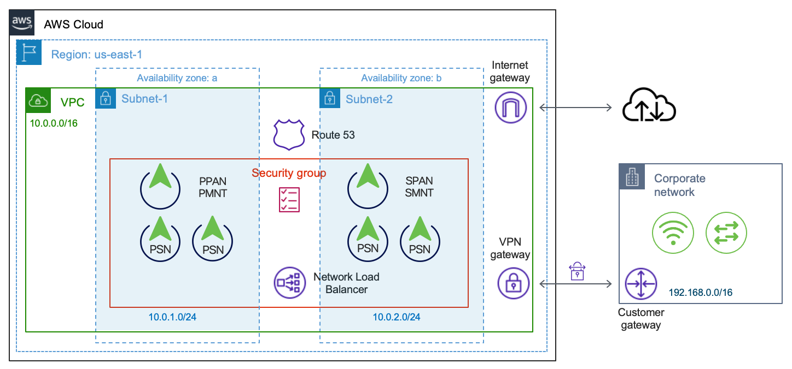

# 20211207 ISE Webinar

This project runs Terraform + Ansible demo for ISE. It follows the demo performed during the Automated ISE setup with Infrastructure as Code tools (December 2021) @ [Cisco ISE YouTube Channel] (http://cs.co/ise-videos)
At a high level it does the following:

Terraform:
- Setup VPC and other networking resources
- Setup 6 ISE instances: Uses two separate modules
- Setup AWS Network Load Balancer
- Setup Route 53 entries
- Setup S3 bucket with transfer family for SFTP access
- Create Ansible variables file

Ansible:
- Import Certificate
- Setup AD
- Add sample groups & users
- Add sample network devices
- add sample policy sets
- Form a deployment among 6 ISE nodes: Two Admin/Monitoring and Four Policy Services Node

ACME (Automated Certificate Management Environment)
- The `ansible_demo.sh` utilizes ACME protocol to get signed certificate from Let's Encrypt OpenCA using DNS validation. This is not mandatory and can be ignored or remarked to skip the process. 

This has been tested and supports Cisco ISE 3.1.



## Requirements
- Ansible >= 2.9
- Terraform >= 1.0.7
- [Cisco ISE SDK](https://github.com/CiscoISE/ciscoisesdk) v1.0.0 or newer
- Python >= 3.6, as the Cisco ISE SDK doesn't support Python version 2.x

## Install (Linux)
Terraform must be installed

Python & pip must be installed
```
sudo apt install -y python3 --version
sudo apt install -y python3-pip
```

Install ISE Python SDK
```
pip3 install ciscoisesdk
```

Ansible must be installed
```
sudo apt update
sudo apt-get install software-properties-common
sudo apt-add-repository ppa:ansible/ansible
sudo pip install ansible
```

Install the collection
```
ansible-galaxy collection install cisco.ise
```

## Use
First, initialize Terraform:
```
terraform init
```

Rename the included `terraform.samplevars` to `terraform.tfvars` file and modify to suit your environment:
```
mv terraform.samplevars terraform.tfvars
```

Modify the `run_firt.sh` to suit your environment. Note the username `admin` should not be changed and the `password` entry should be more than 8 characters long and have at least one of each; lower, upper, and a number. Run the `run_first.sh` to generate the userdata files that will be referenced by terraform config.

Apply the configuration
```
terraform apply
```

Type `yes`

This will take about 30 mintes for ISE instances to be fully booted up. Once both nodes can be accessed via GUI, you can run the ansible playbook.
```
cd ansible
ansible-playbook demo_all.yml
```

Once demo finishes, you can run following to remove the setup in AWS:
```
cd ..
terraform destroy
```

Note that the Terraform process creates the Ansible variables file `vars.yml` upon completion and as such if running the Ansible playbook without running the Terraform file, then copy the content of the `ansible_var.tpl` file to `ansible/vars.yml` file manually.

The examples found on the `playbooks` directory uses the `group_vars` variables. Consider using `ansible-vault` to encrypt the file that has the `ise_username` and `ise_password`.

## Attention macOS users

If you're using macOS you may receive this error when running your playbook:

```
objc[34120]: +[__NSCFConstantString initialize] may have been in progress in another thread when fork() was called.
objc[34120]: +[__NSCFConstantString initialize] may have been in progress in another thread when fork() was called. We cannot safely call it or ignore it in the fork() child process. Crashing instead. Set a breakpoint on objc_initializeAfterForkError to debug.
ERROR! A worker was found in a dead state
```

If that's the case try setting these environment variables:
```
export OBJC_DISABLE_INITIALIZE_FORK_SAFETY=YES
export no_proxy=*
```

You can also run the following:
```
cd ansible
source source_me.sh
```

## License

The examples in this repository are licensed under the [Cisco Sample Code License](https://developer.cisco.com/site/license/cisco-sample-code-license/).
